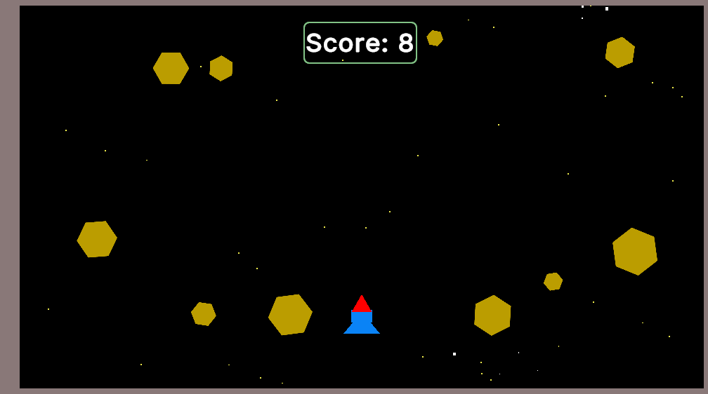

Here's an updated README for your game **Jet Crash** with all the details you provided:

---

# **Jet Crash** ✈️💥  
**Survive as long as possible by dodging asteroids!**  

  

## **Game Description**  
Jet Crash is an exciting survival game where you control a jet and must avoid incoming asteroids for as long as possible. The longer you survive, the higher your score!  

- **Controls**:  
  - **Touch** (Mobile)  
  - **Mouse** (PC/Web)  
- **Physics**: Uses **Polygon Colliders** for accurate collision detection.  
- **Built with**: **Unity 6** (using built-in sprites).  

## **Play the Game** 🎮  
👉 **[Play on Unity Play](https://play.unity.com/en/games/1175a415-8c4b-4e0b-811f-389567f083b9/jet-crash)**  

## **Features**  
✔ Simple yet challenging gameplay  
✔ Smooth touch & mouse controls  
✔ Dynamic asteroid spawning  
✔ Score tracking for survival time  

## **Developer**  
👨‍💻 **Muhammad Hasnain Khan**  
- Entire game developed in Unity.  

---

Let me know if you'd like any changes or additions! 🚀
